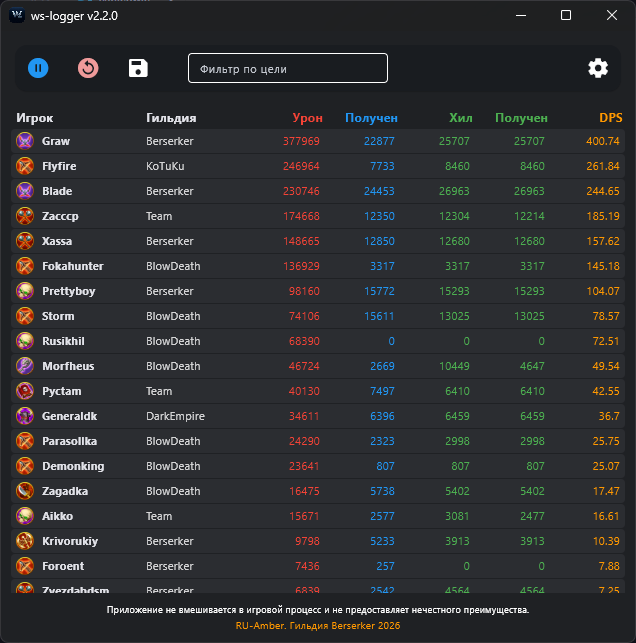
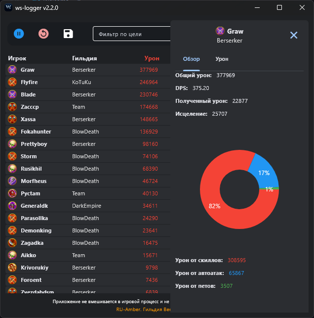

  

<strong>ws-logger </strong>

Aplicativo para rastrear estatísticas de combate no jogo Warspear Online. Ele determina automaticamente o dano causado e a cura dos jogadores, exibindo os dados em uma tabela.

## Funcionalidades
- Rastreamento de estatísticas de dano e cura em tempo real.
- Métricas detalhadas de dano causado, dano recebido, cura, cura recebida e autocura.
- Atribuição correta de dano e cura de pets aos seus donos.
- Possibilidade de ordenar dados por qualquer coluna.
- Filtragem de estatísticas por alvo específico.
- Clique no jogador para ver estatísticas detalhadas de dano por alvos.
- Exportação de resultados em tabela Excel ou SQLite (.db).
- Detecção automática de entrada em raid e exportação automática de estatísticas (ativado nas configurações).
- Gerenciamento de configurações de servidor, interface de rede e versão do cliente dentro do aplicativo.

## Requisitos
- **SO**: Windows 10/11 (x64)
- **Driver Npcap**: Necessário para capturar tráfego de rede.
- **Versão do jogo**: Warspear Online 13.3.x (suporta versões Normal e Steam).
- **Direitos de administrador**: Necessários para acesso às interfaces de rede.

## Instalação
1.  **Baixe a versão mais recente** da [página de releases](https://github.com/shttl/ws-logger/releases).
2.  **Instale o Npcap:**
    - Baixe o Npcap do [site oficial](https://npcap.com/).
    - Durante a instalação, certifique-se de selecionar a opção:
        - `Install Npcap in WinPcap API-compatible Mode`
3.  Descompacte o arquivo do programa em um local conveniente.

## Uso
1. Inicie o jogo e entre no seu personagem.
2. Execute `ws-logger.exe` como administrador.
3. Em **Configurações**, selecione a interface de rede correta e o servidor do jogo.
4. Selecione o formato de exportação preferido (Excel ou SQLite).
5. Pressione o botão **"Iniciar"** para começar a coleta de estatísticas.
6. O aplicativo começará a rastrear eventos automaticamente. Ao final da batalha ou raid, use o botão **"Parar"** ou aguarde o salvamento automático (para raids).

  

  

## Configuração
Todas as configurações são gerenciadas através do botão **"Configurações"** na interface do aplicativo. O arquivo `user_settings.json` é criado automaticamente e será atualizado pela interface gráfica.

Configurações disponíveis:
- **Interface de rede:** Selecione a interface de rede que seu computador usa para acessar a internet. Se não tiver certeza, o nome correto pode ser encontrado executando o comando `ipconfig` no prompt de comando.
- **Servidor do jogo:** Selecione o servidor do jogo no qual você joga.
- **Cliente do jogo:** Especifique a versão do cliente do jogo que você usa (`Normal` ou `Steam`).
- **Formato de exportação:** Selecione o formato para salvar a tabela de estatísticas (`Excel` ou `SQLite`).
- **Gravação automática de raids:** Ative ou desative a detecção automática e gravação de estatísticas de raids.

## Solução de problemas
1.  **O programa não vê nenhum evento:**
    - Certifique-se de executar o programa com direitos de administrador.
    - Selecione novamente a interface de rede correta nas configurações.
    - Certifique-se de que o servidor do jogo esteja corretamente selecionado.
    - Reinicie o programa, após entrar no seu personagem do jogo.
2.  **O antivírus bloqueia o aplicativo:**
    - Adicione a pasta do programa à lista de exceções do seu antivírus.
    - Permita ao aplicativo acesso à rede nas configurações do seu firewall.

## Importante!
**Esta ferramenta é destinada exclusivamente à coleta e análise de estatísticas. Ela não fornece vantagem injusta e não interfere no processo do jogo. Toda a responsabilidade pelo uso do programa é sua.**